```{r setup, include=FALSE}
knitr::opts_chunk$set(
	echo = FALSE,
	fig.align = "center",
	fig.width = 10,
	message = FALSE,
	warning = FALSE
)
source("R/packages.R")
source("R/functions.R")
```

```{r sources, cache=TRUE, include=FALSE}
source("R/tables.R")
source("R/graphics.R")
source("R/textanalysis.R")
```
> O presente relatório foi elaborado no intuito de demonstrar a aplicação das técnicas de *Web Scraping* aprendidas durante a edição 09/2020 do curso realizado pela [curso-r](https://curso-r.com/). O objetivo foi obter e analisar dados de publicações da Embrapa.

# Apresentação

Uma empresa voltada para a inovação, que foca na geração de conhecimentos e tecnologias para a agropecuária brasileira. É dessa forma que a Empresa Brasileira de Pesquisa Agropecuária (EMBRAPA) é apresentada ao público em seu [site](https://www.embrapa.br/sobre-a-embrapa).

Criada pelo Ministério da Agricultura, Pecuária e Abastecimento (Mapa) em 1973, com o objetivo de desenvolver a base tecnológica de um modelo de agricultura e pecuária genuinamente tropical, a EMBRAPA enfrenta desde então o desafio constante de garantir ao Brasil segurança alimentar e posição de destaque no mercado internacional de alimentos, fibras e energia.

Dentre as estratégias da EMBRAPA para cumprir sua missão de "viabilizar soluções de pesquisa, desenvolvimento e inovação para a sustentabilidade da agricultura, em benefício da sociedade brasileira", insere-se o "permanente diálogo com produtores, organizações científicas e lideranças do Estado e da sociedade civil".

No atual cenário de desenvolvimento de tecnologias de comunicação, a conectividade é vista como fator estratégico para as organizações, independentemente de sua área de atuação. Por entender a importância desse recurso, a EMBRAPA considera a conectividade como um dos valores que balizam suas práticas e comportamentos.

A empresa busca interagir com todos os estratos **geradores** de **conhecimento** e de **tecnologia** e com todos os **beneficiários** a partir da geração de impacto por meio das tecnologias desenvolvidas por ela e por seus parceiros.

## Objetivo

Considerando o papel da EMBRAPA na geração e compartilhamento de conhecimento e tecnologias e a importância estratégica da conectividade para o acance de seus objetivos, busquei analisar a comunicação da empresa a partir de dados coletados em seu site. Mais precisamente, foram coletados e analisados dados disponíveis na [Base de Dados da Pesquisa Agropecuária (BDPA)](https://www.bdpa.cnptia.embrapa.br/consulta/) com o objetivo de descrever quantitativa e qualitativamente os meios pelos quais a EMBRAPA busca comunicar os resultados de suas pesquisas, além dos temas e tópicos abordados.

Os dados disponíveis foram coletados por meio da técnica de *Web Scraping* e análisados a fim de fornecer uma visualização dos conteúdos dos documentos. Foram analisados os termos mais recorrentes e suas associações, os tipos e os formatos das publicações, as categorias em que foram classificados, o grau de complexidade dos textos, dentre outras análises.

Devido ao grande volume disponível de dados e da vasta abrangência das pesquisas da EMBRAPA, tanto em termos geográficos quanto em diversidade de temas, fiz um recorte buscando publicações relacionadas ao tema **Agricultura Familiar**. Essa escolha foi direcionada, em primeiro momento, pelo caráter público da empresa, mas também pelo fato de a garantia de *segurança alimentar* e *aspectos sociais* estarem entre suas pautas principais.

## A Base de Dados da Pesquisa Agropecuária (BDPA)

A Base de Dados da Pesquisa Agropecuária (BDPA) é formada pelos acervos das bibliotecas da Embrapa. É composta por publicações resultantes dos processos de pesquisa e desenvolvimento da Empresa e por outros documentos adquiridos por compra e doação, relacionados às ciências agrárias e áreas correlatas, nos formatos impresso e digital, como livros, artigos de periódicos, folhetos, teses, trabalhos apresentados em eventos técnico-científicos e mapas, dentre outros.

```{r tela1, fig.cap="Página inicial"}
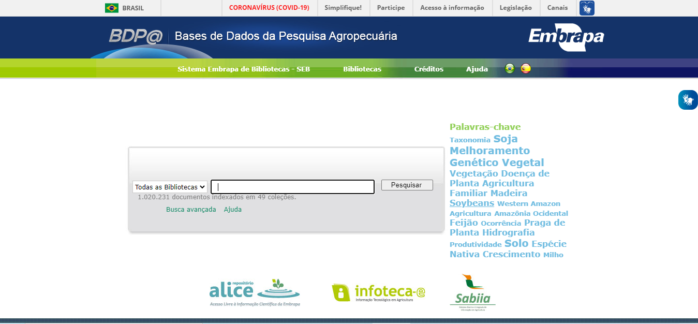
```
A BDPA apresenta os metadados das publicações que a integram, além do acesso ao texto integral de parte relevante desse conjunto. Utiliza o *software Ainfo Consulta*, um dos componentes do sistema *Ainfo 6*, desenvolvido em parceria entre a equipe de tecnologia da informação da [Embrapa Agricultura Digital](https://www.embrapa.br/agricultura-digital), a Comissão Permanente para o Ainfo, o Grupo de Trabalho de Referenciação Bibliográfica e o Sistema Embrapa de Bibliotecas.

```{r tela2, fig.cap="Página de resultados de busca"}
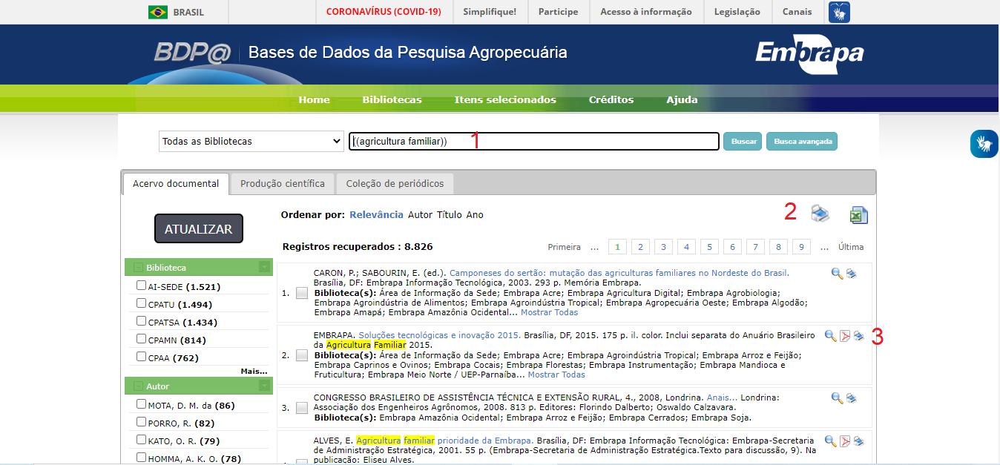
```
Como visto na imagem anterior, a ferramenta de busca da base de dados apresenta opções para busca por meio de palavras-chaves (1), impressão e *download* de listagens de publicações em formato resumido (2) e visualização de informações detalhadas sobre cada publicação, como autoria, ano de publicação, tópicos abordados, dentre outros dados (3). A impressão e o *download* das listagens de publicações é limitada a 2000 documentos por vez. Por outro lado, a visualização das informações deve ser feita documento por documento por meio dos *links* representados pelos ícones ao lado de cada item.

```{r tela3, fig.cap= "Modelo de ficha de registro completo"}
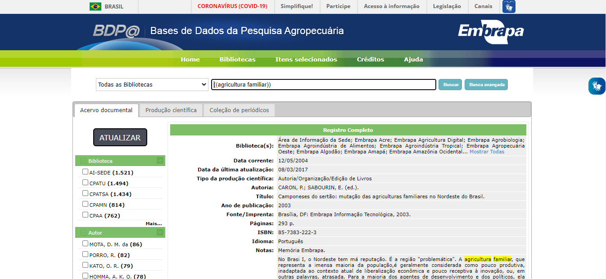
```
O *site* disponibiliza metadados para cada documento indexado no sistema de bibliotecas, por meio dos quais é possível realizar as análises quantitativas como o volume de publicações: o longo dos anos; por tipo de publicação; por categoria e tipo de mídia (material), como também as análises qualitativas como os termos mais frequentes, os produtos, os temas e a localização geográfica onde as pesquisas foram realizadas.

## Coleta dos dados

Em virtude do volume de documentos e da forma como são disponibilizados na base de dados, a coleta e consolidação dos dados manualmente seria inviável. Sendo assim, a estratégia de coleta de dados adotada contou com a técnica de *Web Scraping* que consistem na coleta a partir de *softwares* que simulam as requisições que seriam realizadas no acesso manual. Sendo assim, construí os *scripts* em linguem R [@rcoreteam2021] organizando todo o processo de coleta, análise descritiva e análise textual conforme apresentado a seguir.

### Pacotes e recursos

Embora existam diversas ferramentas que podem ser utilizadas para *Web Scraping*, optei por utilizar os pacotes [httr](https://httr.r-lib.org/index.html) [@httr] para a realização das requisições necessárias para o acesso às páginas e o gerenciamento das sessões, [rvest](https://rvest.tidyverse.org/) [@rvest] para extração de tabelas, [xml2](https://xml2.r-lib.org/) [@xml2] para parseamento das páginas, além dos pacotes do [tidyverse](https://www.tidyverse.org/) [@tidyverse] para manipulação dos dados. Uma vez criado o banco de dados, recorri aos pacotes [quanteda](https://quanteda.io/index.html) [@quanteda], [textmineR](https://www.rtextminer.com/) [@textmineR], [text2vec](https://text2vec.org/) [@text2vec], [stringi](https://stringi.gagolewski.com/) [@stringi], [proxyC](https://github.com/koheiw/proxyC) [@proxyC] e [LDAvis](https://github.com/cpsievert/LDAvis) [@LDAvis] para a análise textual. Os *scripts* contendo todos os detalhes do projeto podem ser encontrados [aqui](https://github.com/profmarcelojesus/embrapa.git).

### Etapas do processo de coleta

O processo de *Web Scraping* se inicia com a identificação dos dados de interesse. Em seguida é necessário navegar até as páginas e estudar sua estrutura, observar como os dados estão dispostos, além de aspectos inerentes à construção do *site* e acesso às informações. A partir daí é necessário reproduzir por meio de pacotes e *scripts* as etapas de replicação (realização das requisições necessárias para acesso e *download* dos dados), parseamento (limpeza e extração das informações relevantes) e validação. Uma vez elaborados e testados os *scripts* e assegurando-se de que as informações podem ser obtidas como desejado, segue-se a etapa de iteração onde se realizam as operações de reprodução quantas vezes forem necessárias para a obtenção de todos os dados de interesse.

```{r figciclows, fig.cap='Ciclo de Web Scraping'}
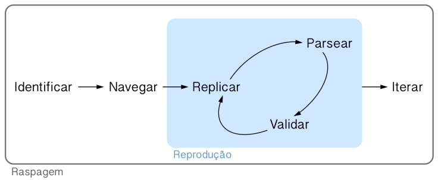
```
Para este estudo, as seguintes etapas principais foram percorridas:

-   Busca e navegação nos *sites* da EMBRAPA para identificar a localização das publicações.
-   Análise da estrutura de construção do *site* da BDPA e das requisições necessárias para acesso aos dados.
-   Desenvolvimento de *scripts* e funções em linguagem `R.`
-   Realização de uma busca inicial para obtenção do número total de publicações que atendem aos critérios de busca.
-   Obtenção da lista de *links* para cada uma das páginas contendo as informações detalhadas.
-   Importação de cada página e armazenamento em disco.
-   Leitura das *tags* das páginas e criação de tabelas.
-   Iteração em todos os resultados da busca e composição da base de dados.
-   Elaboração de gráficos e tabelas.
-   Interpretação dos resultados.

### Descrição das etapas de Web Scraping

Para executando manualmente a busca na base, inseri a expressão de busca (1) "agricultura familiar", sem aspas selecionando 100 registros por página (2) para exibição dos resultados. 

```{r tela5, fig.cap='Critérios iniciais de busca'}
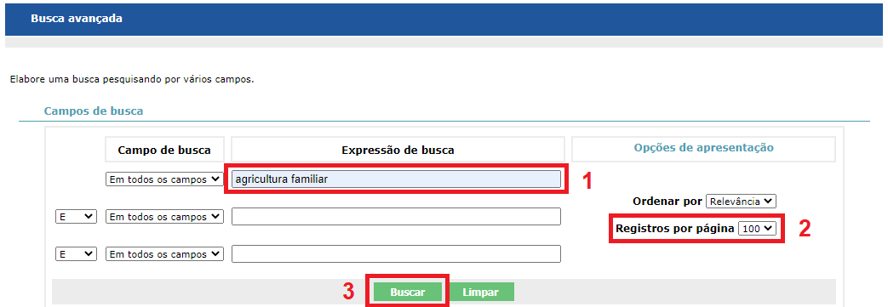
```
Ao clicar em buscar (3), verifiquei que a página chama a função busca que realiza uma instrução do tipo POST para a url https://www.bdpa.cnptia.embrapa.br/consulta/busca (\@ref(fig:tela6)) passando como parâmetros o tipo de busca (simples e avançada) e três conjuntos field~n~ + value~n~ além das informações sobre a ordem, número de registros por página e outras opções que poderiam ser passadas pelo formulário de busca avançada (\@ref(fig:tela7)).

```{r tela6, fig.cap='Requisição POST'}
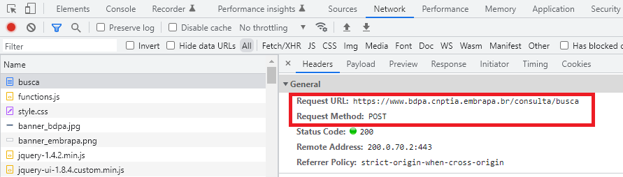
```
```{r tela7, fig.cap='Parâmetros da requisição POST'}
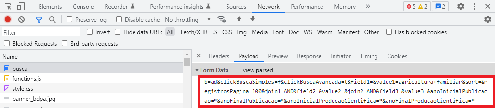
```
Os resultados da busca são apresentados conforma a (\@ref(fig:tela2)). Para acessar a página que contém as informações sobre o registro deve-se clicar na lupa ao lado do cabeçalho do registro. O clique na lupa chama novamente a função busca, mas deste vez passando uma instrução do tipo GET e como parâmetros a id do resgistro o página atual do registro (\@ref(fig:tela8)).

```{r tela8, fig.cap='Requisição GET com id do registro'}
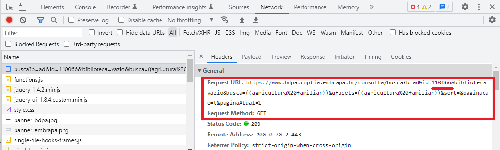
```
Observando a estrutura da página verifiquei que os resultados são apresentados em uma tabela em que cada registro apresenta o *link* para *Visualizar de detralhes do registro* no parâmetro *href*. 

```{r tela9, fig.cap='Elemento html contendo o *link* para detalhes do registro'}
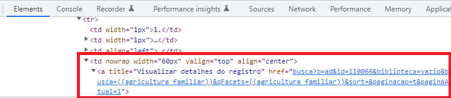
```
Como se observa, os resultados são paginados sendo necessário percorrer todas as paginas para se obter a lista completa de *links* para detalhes dos registros. Desta forma foram criadas as funções `buscar_paginas` que recebe como parâmetro o número da página a ser lida, chama a função `pegar_links` que obtem a lista de *links* dos registros de cada página e na sequência faz o *download* de cada página de detalhes do registro por meio da função `baixar_registro`. Após serem baixados todos os registros repete-se o processo na próxima página de resultados.

Uma vez que todas as páginas de detalhes dos registros foram baixadas realizei o processo de parseamente para extração das informações relevantes. Para isso criei a função `ler_registros` que obtém o elemento `td` contendo a classe `colunaRegistro`

```{r tela10, fig.cap='Elemento *td* contendo a classe *colunaRegistro*'}
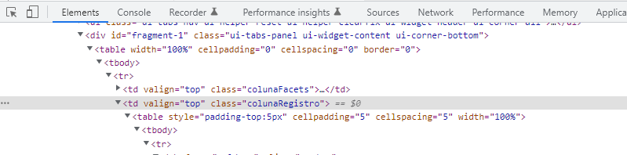
```

O processo de leitura das página gerou a tabela `registros`, uma tibble com `r nrow(registros)` observações e  `r ncol(registros)` variáveis.

```{r headregistros}
head(registros)
```
A função `ler_formatos` foi utilizada para copiar as informações sobre os exemplares disponíveis para cada registro. Essa informação encontrava-se em outra tabela logo abaixo dos detalhes (\@ref(fig:tela11)). 

```{r tela11, fig.cap='Tabela de exemplares disponíveis'}
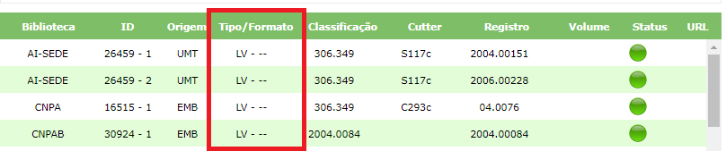
```

Verifiquei que a tabela poderia ser obtida por meio da classe `registroCompletoExemplar` (\@ref(fig:tela12)).

```{r tela12, fig.cap='Elemento elemento *tr* contendo a classe *registroCompletoExemplar*'}
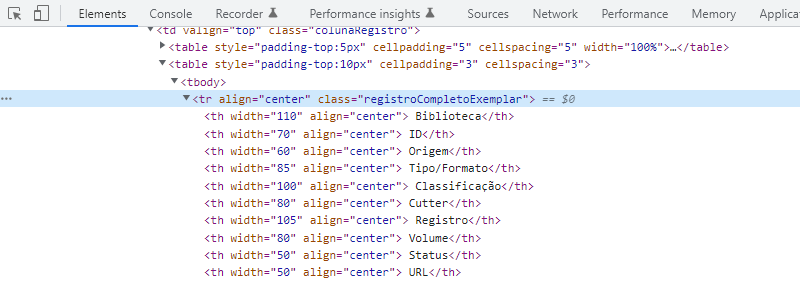
```
Os informações foram guardadas na tabela `formatos`, uma tibble com `r nrow(formatos)` observações e  `r ncol(formatos)` variáveis, indexada pela `id` do registro. Durante as análises esta tabela e demais informações foram anexadas à tabela `registros` para obtenção de informações quantitativas.

```{r headformatos}
head(formatos)
```

## Resumo dos dados coletados

```{r anoinicial}
ano_inicial <- 
  registros |> 
  filter(ano_de_publicacao > 0) |> 
  summarise(ano_de_publicacao = min(ano_de_publicacao))
```
Foram encontradas 8487 publicações relacionadas ao termo *Agricultura Familiar* na base de dados. Existem documentos publicados desde o ano de `r ano_inicial$ano_de_publicacao` como se pode observar no gráfico a seguir.

```{r plotdocumentosporano, fig.width=10, fig.cap="Volume de Publicações por Ano"}
ggplotly(plot_documentos_por_ano)
```
É possível notar um crescimento das publicações a partir da década de 1990 que parece ter se mantido até o final dos anos 2010. Considerando-se todo o período posterior, percebe-se uma tendência de queda, embora os anos de 2015 e 2016 tenham apresentado picos no número de publicações. É importante frisar que estão sendo considerados apenas os resultados relacionados com a *Agricultura Familiar*, de modo que o gráfico não representa o volume total de publicações da EMBRAPA no período. Pode-se inferir que a evolução do gráfico indica um aumento na representatividade do tema, seguido por uma recente diminuição. Contudo, não é possível concluir sem que sejam analisados os demais documentos.

```{r ndocs}
ndocs <- 
  registros |> 
  filter(!is.na(tipo_da_producao_cientifica)) |> 
  count(tipo_da_producao_cientifica) |> 
  filter(n == max(n))
```
Considerando que o maior volume de publicações é observado a partir de 1990, optei por analisar apenas as publicações posteriores a essa data para melhor visualização dos resultados. Conforme se verifica no gráfico a seguir, as públicações disponíveis na biblioteca da EMBRAPA estão classificadas em 19 *tipos de produção científica*. O maior volume de documentos concentra-se em *`r ndocs$tipo_da_producao_cientifica`* com `r ndocs$n` publicações.

```{r plotdocumentosportipo, fig.width=10, fig.cap="Volume de Publicações por Tipo de Produção Científica"}
plot_documentos_por_tipo
```

As públicações da EMBRAPA são classificadas também de acordo com o *tipo de mídia* utilizada para a comunicação, conforme se observa a seguir. É possível perceber que o aumento no volume de publicações observado entre os anos 1990 e 2010 é influenciado pelas publicações em *formato impresso*. A partir de 1995 foram publicados os primeiros *documentos em formato eletrônico*, embora o número anual de publicações nesse formato tenha se mantido abaixo de 40 durante todo o período.

```{r plotdocumentosporanoformato, fig.width=10, fig.cap="Volume Anual de Publicações por Tipo de Material"}
ggplotly(plot_documentos_por_ano_formato)
```
Da mesma forma, pode-se verificar a evolução das publicações por *tipo de produção científica* ao longo dos anos. É possível observar que as públicações aumentam em diversidade de tipos com o passar do tempo, o que pode indicar um esforço da empresa para atingir o público-alvo de maneira mais efetiva e adequada a necessidades de comunicação específicas. Além de materiais genuinamente científicos como *teses*, *artigos* e *livros*, outros materiais foram produzidos como *folhetos*, *manuais* e *vídeos,* dentre outros recursos audiovisuais.

```{r plotdocumentosporanotipo, fig.width=10, fig.cap="Volume Anual de Publicações por Tipo de Publicação"}
ggplotly(plot_documentos_por_ano_tipo)
```
Verificou-se em 2004 um pico no volume de folhetos que foi seguido por um declínio constante até o final do período. Entre os anos de 2004 e 2016, observa-se também um aumento no volume de filmes e gravações de som. Isso indica que a empresa deve ter buscado como estratégia de comunicação meios audiovisuais em outros meios de comunicação.

A base de dados fornece ainda informações sobre os assuntos relacionados com as publicações. Ao todo os documentos são classificados em 18 *categorias*, como se observa no gráfico a seguir. Embora o maior volume seja de publicações não classificadas em nenhum assunto específico, é possível notar que a temática (B) *sociologia rural* vem ganhando espaço entre as publicações, chegando a 106 documentos em 2020.

```{r plotdocumentosporcategoria, fig.cap="Volume Anual de Publicações por Categoria do Assunto"}
ggplotly(plot_documentos_por_categoria)
```
Outros temas também apresentam evolução similar como (A) *sistemas de cultivo*, (P) *recursos naturais, ciências ambientais e da terra*, (E) *economia e indústria agrícola*, (F) *plantas e produtos de origem vegetal*, (K) *ciência florestal e produtos de origem vegetal* e (L) *ciência animal e seus produtos*. Um destaque interessante se dá para publicações sobre (G) *melhoramento genético* que atingiu um pico em 2004 (65 documentos) e após esta data vem ocilando entre 1 e 6 publicações catalogadas.

# Análise lexical

Após o primeiro contato com os dados das publicações passei a analisar as indicações de conteúdo apresentadas pela biblioteca. Nesta etapa utilizei, principalmente, o pacote [quanteda: Quantitative Analysis of Textual Data](https://quanteda.io/index.html), um pacote R para gerenciar e analisar dados textuais, desenvolvido por [Kenneth Benoit](http://kenbenoit.net/), [Kohei Watanabe](https://blog.koheiw.net/) e outros colaboradores.

Para as análises textuais, o *corpus* foi formado inicialmente a partir do campo *conteúdo* das páginas de registro completo, onde se apresenta uma descrição sucinta dos assuntos tratados nos registros, conforme o exemplo a seguir. Entretanto, nem todos os documentos continham informações nesse campo, de modo que foi necessário filtrar dos dados para análise.

```{r tela4, fig.cap='Campo conteúdo dos registros', fig.align='center'}
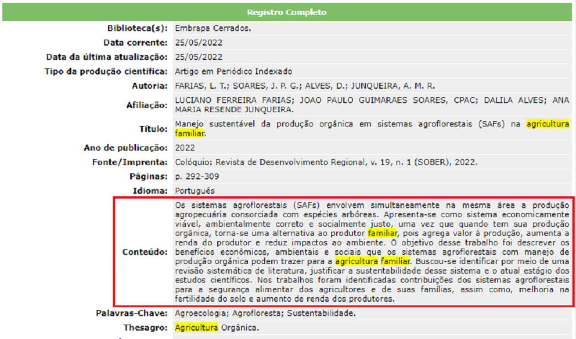
```
O objetivo dessa análise foi identificar padrões e tendências nos termos utilizados. Para tanto, busquei verificar as palavras ou expressões mais frequentes, a coocorrência entre os termos, assim como as diferenças entre grupos como, por exemplo, entre documentos digitais e outros tipos de formato e entre categorias.

A tabela a seguir apresenta a estrutura dos dados após a filtragem. Foram acrescentadas as variáveis `Ano`, `Idioma` e outra variável para indicar se o documento possui *link* para acesso *online*. Nessa etapa foram analisados os conteúdos de 5671 registros cujo campo *conteúdo* não estava vazio.

```{r summary}
s <- summary(corpus_conteudo, n = 5)
c <- 
  paste0(
  "Corpus consistindo de ", 
  attr(s, "ndoc_all") , 
  " documentos. Mostrando ", 
  attr(s, "ndoc_show"), 
  " documentos")

js <- c(
  "function(settings){",
  "  var datatable = settings.oInstance.api();",
  "  var table = datatable.table().node();",
  paste("  var caption = '", c, "'"),
  "  $(table).append('<caption style=\"caption-side: bottom\">' + caption + '</caption>');",
  "}"
)

s$Text <- paste0(str_sub(string = s$Text, start = 1, end = 30), "...")

datatable(as.data.frame(s)[,-5],
          caption = 'Tabela 1 - Cabeçalho do corpus',
          colnames = c('Título' = 'Text', 
                       'Tipos' = 'Types', 
                       'Sentenças' = 'Sentences',
                       'Cont. Dig.' = 'Conteudo_digital'),
          options = list(initComplete = JS(js), 
                         dom = 't'))
```

## Palavras-chaves em contexto

Utilizei a função `kwic` (*keywords in context*) do pacote `quanteda` para a identificação de expressões em contexto nas frases onde se encontram. A seguir pode-se observar algumas frases relacioandas com a *Agricultura Familiar* e o título do documento correspondente. Por exemplo, os textos falam de *fortalecimento da agricultura familiar em transição agroecológica*, *perspectivas de desenvolvimento da agricultura familiar*, *relevância da agricultura familiar*, *tecnologias para a agricultura familiar* e varios outros tópicos.

```{r kwic}
t <- kwic(corpus_conteudo |> 
            tokens(remove_numbers = TRUE, 
                   remove_punct = TRUE), 
          pattern = phrase("agricultura familiar"), 
          window = 4)
t <- as.data.frame(t)[-c(2,10),c(1,4:6)]
t$docname <- paste0(str_sub(string = t$docname, 
                            start = 1, 
                            end = 25), "...")
datatable(t,
  caption = 'Tabela 2 - Palavras-chaves em contexto',
  colnames = c('Título' = 'docname', 
               'Pré' = 'pre', 
               'Palavra-chave' = 'keyword', 
               'Pós' = 'post'
               ),
  options = list(
    columnDefs = list(
      list(
        width = '30%', 
        targets = list(1)
        )
      ),'dom' = 'tp'
    )
  )
```

*Agricultura Familiar*, nesse contexto, é entendida como uma expresão composta. Ou seja, para o propósito da análise as palavras devem estar juntas. Da mesma forma, outros termos adquirem significado ao serem associados como, por exemplo, *políticas públicas*, *desenvolvimento sustentável*. Sendo assim, os substantivos que representam nomes de cidades, entidades ou expressões compostas foram ligados de modo a serem considerados como *token* único. Também foram subtituídas todas as ocorrências de nomes de entidades e organizações por suas respectivas siglas como, por exemplo, "Empresa Brasileira de Pesquisa Agropecuária" por "EMBRAPA".

## Colocações

Foi possível identifcar outros termos associados e sua frequência nos documentos por meio da análise de colocações (`collocation`) realizada pelo pacote `quanteda`. Como visto na tabela a seguir, pode-se obter o número de vezes que os termos aparecem próximos uns dos outros, além dos valores `lambda` e `z` que indicam o quão próximas as palavras encontran-se em relação aos demais *tokens*.

```{r col}

t <- col
DT::datatable(t[,-c(3:4)],
  caption = 'Tabela 3 - Análise de colocação de termos',
  colnames = c('Colocação' = 'collocation', 
               'Freq.' = 'count', 
               'Lambda' = 'lambda'
               ),
  options = list(
    columnDefs = list(
      list(
        width = '30%', 
        targets = list(1)
        )
      ), dom = 'ftp'
    )
  )

```
A expressão composta mais frequente nos documentos além dos termos de busca é *sistema [de] produção*, considerando-se que a preposição "de" foi excluída. Na sequência, a *reforma agrária* vêm como a segunda temática mais frequente seguida por *políticas públicas*, *desenvolvimento rural*, *meio ambiente*, *recuros naturais* e *segurança alimentar*, dentre outros temas sensíveis, tanto para o setor da *Agricultura Familiar* como para a sociedade em geral. Essas colocações foram utilizadas para formar novas expressões compostas a serem analisadas em relação aos demais termos do *corpus*.

## Nuvem de palavras

Partindo para a análise das diferenças entre tipos, a nuvem de palavras a seguir apresenta os termos mais frequentes agrupados por tipode de material. Como descrito na apresentação dos dados, as publicações estão classificadas quanto à midia utilizada, sendo o suporte físico em formato impresso o mais frequente. A nuvem de palavras demonstra em quais tipos de materiais cada termo é mais representativo, relativamente aos demais termos no grupo. As palavras não se repetem entre os grupos.

```{r wordcloud, fig.height=8, fig.cap="Palavras mais frequentes por tipo de acesso"}
plotar_word_cloud(min_termfreq = 0, max_words = 2500, min_size = 0.4, max_size = 4)
```
A interpretação das palavras deve considerar sua representatividade no grupo. Por exemplo, o termo *programa* é mais representativo paro o grupo de discos (*CD-ROM/DVD/Videodiscos* do que para os demais grupos. Isso compreensível devido ao fato de que neste grupo os documentos se referem em grande parte a exibições em programas e TV. Já os termos *agricultura*, *desenvolvimento*, *agricultura familiar* e *reforma agrária* são mais representativos para no grupo de *fitas magnéticas/videocassete/microfilmes e outros*. Importante ressaltar que este grupo contempla também os documentos sem informação sobre o tipo de midia. Enquanto isso, os termos *Embrapa* e *objetivo* são mais importantes para o grupo de *documentos digitais*, enquanto termos como *pesquisa*, *amazônia* e *nordeste* são mais importantes no grupo dos *materiais impressos*.

Cada palavra poderia ser analisada quanto ao grupo para o qual ela é representativa. Embora seja um exercício interessante, a núvem de palavras por tipo de material possui pouco conteúdo informacional. De qualquer forma, o método de análise pode servir para obter informações sobre outros tipos de agrupamentos e outros conjuntos de textos.

## Frequência relativa

É possível observar de forma mais clara essa diferença de frequência dos termos por meio dos gráficos de dispersão a seguir. Pode-se notar que o termo *produção* se destaca em todos os grupos. Contudo, as demais palavras ranqueadas sugerem uma diversidade de ênfase dos textos. Por exemplo, no grupo de *documentos eletrônicos* aparecem mais vezes os termos *embrapa* e *sistema* do que *desenvolvimento*, enquanto que *sistema* e *desenvolvimento* são mais representativos no grupo de *documentos impressos*.

```{r freqonline, fig.cap="Frequência relativa de palavras mais frequentes por tipo de acesso"}
ggplot(data = freq_online, aes(x = nrow(freq_online):1, y = frequency)) +
  geom_point() +
  facet_wrap(~ group, scales = "free") +
  coord_flip() +
  scale_x_continuous(breaks = nrow(freq_online):1,
                     labels = freq_online$feature) +
  labs(x = NULL, y = "Frequência relativa")
```
De modo geral, percebe-se uma ênfase produtivista nas publicações. Trata-se de modelo técnico, econômico e social de produção agropecuária apresentado como capaz de proporcionar novas possibilidades para a geração de renda e aumento de capital. Nesse modelo de agricultura, a produção agrícola se tornou refém de um referencial mundial, sendo influenciada pelas mesmas regras que regem os demais aspectos da produção econômica. Esse fato contrasta em certa medida com os princípios que norteiam as políticas voltadas para agricultura familiar no Brasil como produção agroecológica e sustentabilidade [@dallabrida2016].

## Complexidade dos textos

Outra maneira de verifcar se existe uma diferença lexical entre os documentos é a análise de *hapax* (frequência relativa de palavras únicas no documento). Altos índices de *hapax* indicam maior complexidade dos textos, o que é próprio dos documentos técnico-científicos. Entende-se que esses textos são mais apropriados para um público especializado. Desta forma, calculei os índices de *hapax* para dois grupos de documentos, conforme apresentado na tabela a seguir. O resultado indica maior complexidade para os conteúdos dos documentos *online*. Algumas questões devem ser consideradas ao analisar esses valores. Em primeiro lugar, vale lembrar que se trata apenas de resumos dos documentos o que leva a crer que o estilo de escrita seja diferente daquele empregado nos documentos em si. Outro ponto de consideração é que os textos são de tamanho reduzido (\~ 500 palavras) o que explica os altos índices de *hapax*.

<center>

```{r tbhapaxonline}
datatable(as_tibble(tb_hapax_online) |> arrange(desc(Hapax)), 
          caption = "Tabela 5 - Frequência relativa de hapax por tipo de acesso", 
          colnames = c("Conteúdo digital" = "Conteudo_digital"),
          options = list(dom = "t"), 
          width = 450)
```

</center>

Uma hipótese que pode ser levantada no que se refere aos formatos das publicações e aos públicos aos quais se destina é que deve haver uma difença em termos de complexidade entre o conteúdo dos textos voltados para o público acadêmico, próprio de artigos científicos e outros documentos do gênero, e textos direcionados ao público leigo como os agricultores. No mesmo sentido, os extensionistas usuários das publicações da empresa podem possuir uma vocabulário diferenciado devido à sua formação geralmente mais técnica. A tabela 6 demonstra os índices de *hapax* para cada tipo de material, lembrando que o cálculo é feito a partir das descrições dos documentos e não de seu conteúdo propriamente dito.

<center>

```{r tbhapaxmaterial}
datatable(as_tibble(tb_hapax_material) |> arrange(desc(Hapax)), 
          caption = "Tabela 6 - Frequência relativa de hapax por tipo de material", 
          options = list(dom = "t"), 
          width = 450)
```

</center>

Embora os documentos *online* apresentem maior índice de *hapax* o que indica maior complexidade dos textos, não há como afirmar com base dos dados em análise que o mesmo ocorra com os textos completos. Além disso, a comparação entre materiais impressos e documentos digitais demandaria um processo de digitalição das publicações em suporte físico, de modo que a análise seria possível apenas por amostragem.

## Thesagro

A partir dos dados coletados da base de dados, seria apropriado realizar outras análises como das palavras-chaves informadas ou dos termos do [Thesagro](https://sistemas.agricultura.gov.br/tematres/vocab/index.php) também fornecido.

```{r netthesagro, fig.cap="Rede de termos do thesagro"}
plotar_net_thesagro(min_termfreq = 150)
```
A representação gráfica das ligações entre as palavras mais frequentes pode demonstrar associações e o distanciamanento entre termos e tópicos. As palavras principais encontram-se no centro da rede indicando seu papel de ligação e de contexto. É possível perceber que o *core* do *corpus* analisado é formado pelas ideias de *produção* e *desenvolvimento sustentável*. Esse último conceito surge em proximidade com os termos *pesquisa* e *tecnologia*. Isso revela um aspecto não demonstrado pelas técnicas de *bag of words* aplicadas até agora. Da mesma forma, a localização e as ligações das palavras mais periféricas pode gerar novos *insights*.

Os resultados deste levantamento podem contribuir para iniciar uma discussão sobre o vocabulário empregado na comunicação entre a EMBRAPA e seu público, discussão esta que poderia ser aprofundada por meio da análise de conteúdo das publicações, coleta de dados em outras plataformas como as redes sociais e uma avaliação da repercussão dessa comunicação nas mídia. De qualquer forma, já foi possível tocar a superfície das publicações da EMBRAPA analisadas em conjunto e extrair *insigths* interessantes. Por outro lado, o conjunto de dados obtidos possibilita outras visões a respeito da comunicão da entidade, sobretudo, no que se refere á sua presença *online*, ou seja, sua interação com o público por meio da *internet*.

<center>


Marcelo Chaves de Jesus  
[github.com/profmarcelojesus](https://github.com/profmarcelojesus)
</center>


# Referências
